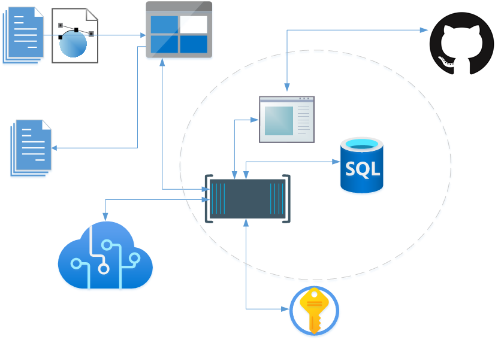

# OCR-on-Azure

## Zespół:
Anna Pręgowska (lider)  
Patrycja Szczepaniak  
Łukasz Leszczyński  

## Opis projektu:
Celem naszego projektu jest stworzenie i wdrożenie aplikacji webowej, która będzie służyła do przetwarzania obrazów lub skanów dokumentów na tekst/formularz lub dokument cyfrowy. Aplikacja będzie umożliwiała stworzenie konta oraz zalogowanie się i przechowywanie obrazów, zeskanowanych dokumentów oraz ich cyfrowych odpowiedników.

## Funkcjonalności:
- Utworzenie konta użytkownika  
- Obsługa logowania i przechowywania plików wcześniej przetwarzanych  
- Wgranie pliku wejściowego - zdjęcia/pdf z danymi tekstowymi w formie graficznej  
- Wyświetlenie tekstu rozpoznanego z pliku wejściowego  

## Architektura:
Projekt zostanie zrealizowany z użyciem języka Python w wersji 3 i frameworka FastAPI.  
Aplikacja webowa będzie uruchamiana w serwisie Azure App Service. Jej kod zostanie zapisany w publicznym repozytorium na stronie Github. Obsługa profili użytkowników planowana jest poprzez Azure Active Directory powiązany ze stworzoną przez nas organizacją.
W ramach projektu użyte zostaną również Azure Cognitive Services (OCR, Form Recognizer) do przetwarzania danych wejściowych (skanów, zdjęć) oraz Azure Blob Storage do przechowywania plików użytkownika.

## Organizacja pracy:
Planujemy wykonać projekt przy wykorzystaniu zwinnej metodyki organizacji pracy. Spotkania będą odbywać się co najmniej raz w tygodniu i będą polegać na omówieniu bieżących postępów i zaplanowaniu zadań na następny sprint. Poniżej znajduje się wstępny harmonogram, który może jednak ulec zmianie w związku z niewielkim zespołem i co się z tym wiąże - wysoką elastycznością.

### Harmonogram:
*(19.11.20 - P1: Przedstawienie projektów)*  
**23.11.20 - Spotkanie organizacyjne. Opracowanie dokumentacji.**  
25.11.20 - Rozszerzenie dokumentacji. Przygotowanie diagramu.  
*(26.11.20 - P2: Prezentacja wstępnej dokumentacji)*  
30.11.20 - Zapoznanie się z działaniem poszczególnych serwisów Azure używanych w projekcie.  
*(6.12.20 - P3: Spotkanie z PO)*  
10.12.20 - Przygotowanie środowiska - weryfikacja kosztów aplikacji, ustalenie polityk SLA.  
22.12.20 - Stworzenie i skonfigurowanie instancji serwisów Web App oraz Cognitive Search. Połączenie aplikacji z repozytorium.
**28.12.20 - Działająca aplikacja webowa, komunikująca się z Azure Cognitive Services, zdolna do wysłania pliku wejściowego i odebrania pliku JSON.**  
03.01.21 - Stworzenie Azure Active Directory i połączenie z aplikacją webową.  
*(07.01.21 - P4)*  
11.01.21 - Formatowanie pliku wyjściowego. (Ewentualnie) stworzenie front-endu aplikacji.
*(14.01.21 - P5)*  
**18.01.21 - Finalna wersja aplikacji.**  
*(21.01.21 - P6)*  
25.01.21 - Testowanie bezpieczeństwa aplikacji. Przygotowanie prezentacji.  
**28.01.21 - P7: Prezentacja projektów.**  

