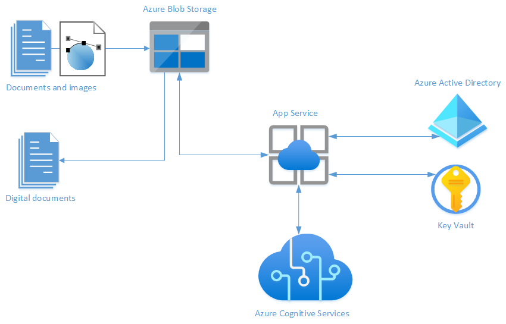
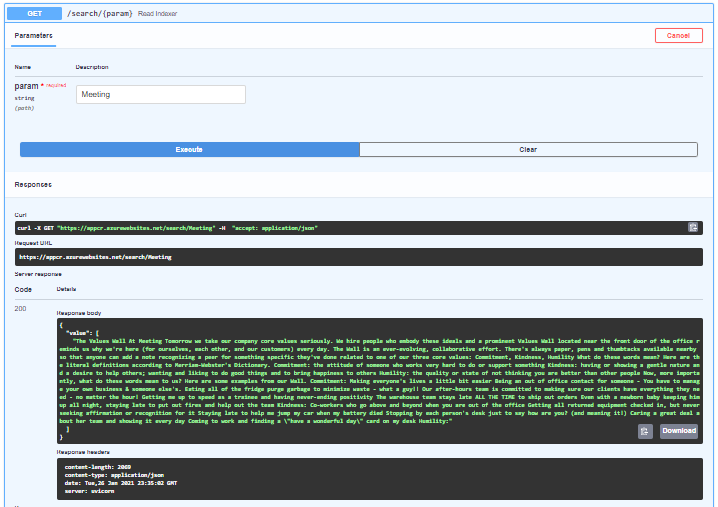

# OCR-on-Azure

## Zespół:
Anna Pręgowska (lider)  
Patrycja Szczepaniak  
Łukasz Leszczyński  

## Opis projektu:
Celem naszego projektu jest stworzenie i wdrożenie aplikacji webowej, która będzie służyła do przetwarzania obrazów lub skanów dokumentów na tekst/formularz lub dokument cyfrowy. Aplikacja będzie umożliwiała stworzenie konta oraz zalogowanie się i przechowywanie obrazów, zeskanowanych dokumentów oraz ich cyfrowych odpowiedników. Dodatkowo dostęp do aplikacji będzie weryfikowany przez Azure Active Directory.

## Funkcjonalności:
- Utworzenie konta użytkownika  
- Obsługa logowania i przechowywania plików wcześniej przetwarzanych  
- Wgranie pliku wejściowego - zdjęcia/pdf z danymi tekstowymi w formie graficznej  
- Wyświetlenie tekstu rozpoznanego z pliku wejściowego  

## Architektura:
Projekt został zrealizowany z użyciem języka Python w wersji 3 i frameworka FastAPI.  
Aplikacja webowa jest uruchamiana w serwisie Azure App Service. Jej kod został zapisany w publicznym repozytorium na stronie Github. Obsługa profili użytkowników wykonana jest poprzez Azure Active Directory powiązany ze stworzoną przez nas organizacją.  
W ramach projektu użyte zostały również Azure Cognitive Services (OCR, Form Recognizer) do przetwarzania danych wejściowych (skanów, zdjęć) oraz Azure Blob Storage do przechowywania plików użytkownika. Sekrety są przechowywane w instancji serwisu Key Vault.

Biblioteki wykorzystywane w projekcie znajdują się w pliku *requirements.txt* i były instalowane jako środowisko wirtualne.  

Używane przez nas serwisy w szczególności przy naszym wykorzystaniu są bezpłatne, natomiast SLA dla naszej aplikacji wynosi 99,6%.

## Organizacja pracy:
Projekt został wykonany przy wykorzystaniu zwinnej metodyki organizacji pracy. Spotkania odbywały się zwykle co najmniej raz w tygodniu i polegały na omówieniu bieżących postępów i zaplanowaniu zadań na następny sprint. W trakcie spotkań było również realizowane wspólnie większość zadań. Poniżej znajduje się nasz harmonogram pracy. W związku z niewielkim zespołem i co się z tym wiąże wysoką elastycznością, harmonogram był na bieżąco dostosowywany do aktualnej sytuacji.

### Harmonogram:
*(19.11.20 - P1: Przedstawienie projektów)*  
**23.11.20 - Spotkanie organizacyjne. Opracowanie dokumentacji.**  
25.11.20 - Rozszerzenie dokumentacji. Przygotowanie diagramu.  
*(26.11.20 - P2: Prezentacja wstępnej dokumentacji)*  
30.11.20 - Zapoznanie się z działaniem poszczególnych serwisów Azure używanych w projekcie.  
*(6.12.20 - P3: Spotkanie z PO)*  
10.12.20 - Przygotowanie środowiska - weryfikacja kosztów aplikacji, ustalenie polityk SLA.  
22.12.20 - Stworzenie i skonfigurowanie instancji serwisów Web App oraz Cognitive Search. Połączenie aplikacji z repozytorium.
**28.12.20 - Działająca aplikacja webowa, komunikująca się z Azure Cognitive Services, zdolna do wysłania pliku wejściowego i odebrania pliku JSON.**  
03.01.21 - Stworzenie Azure Active Directory i połączenie z aplikacją webową.  
*(07.01.21 - P4)*  
11.01.21 - Przygotowanie API aplikacji.  
*(15.01.21 - P5)*  
**22.01.21 - Finalna wersja aplikacji.**  
*(21.01.21 - P6)*  
23.01.21 - Dodanie Key Vault. Testowanie bezpieczeństwa aplikacji. Przygotowanie prezentacji.  
**28.01.21 - P7: Prezentacja projektów.**  

## Działanie aplikacji
W celu uruchomienia aplikacji z poziomu użytkownika należy przejść na adres *https://appcr.azurewebsites.net*. W tym momencie pojawia się okno logowania - zalogować mogą się tylko użytkownicy z organizacji OCR-on-Azure. 

Dodatkowo adres *https://appcr.azurewebsites.net/docs* umożliwia zapoznanie się z dostępnym API aplikacji oraz możliwością przetestowania. Poniżej znajduje się zrzuty, pokazujące opis API prezentowany przez swaggera.

Ekran pokazujący API aplikacji:

Ekran pokazujący przykładowe zastosowanie /get/:

Ekran pokazujący przykładowe zastosowanie /get/search/{param}:

Ekran pokazujący przykładowe zastosowanie /put/:

Aplikacja uruchamiana jest za pomocą skryptu startowego *startup.sh* i postawiona na kontenerze Docker. Dane wrażliwe przechowywane są w Key Vault - nie są przechowywane jawnie. Zarządzanie użytkownikami następuje z poziomu aplikazji Azure Active Directory.  

## Implementacja Azure Active Directory
Problem OCR jest tematem bardzo często omawianym w wielu projektach, dlatego w naszym postanowiliśmy skupić się przede wszystkim na serwisie Azure Active Directory.  

Do naszej instancji serwisu Azure Active Directory postanowiliśmy nie wykorzystywać organizacji Politechniki Warszawskiej, do której jesteśmy przypisani, ponieważ wprowadzała dla nas wiele ograniczeń. Dlatego podczas tworzenia instancji Azure Active Directory stworzyliśmy nową organizację OCR-on-Azure. Cały proces rozpoczęliśmy od wybrania ze strony starowej portalu Azure opcję *Create a resource*, wybierając następnie serwis AAD. 

Ekran pokazujący tworzenie instancji Azure Active Directory:

Po stworzeniu AAD przeszliśmy do ekranu naszej nowej organizacji. W tym celu przy rozwinięciu menu użytkownika w prawym górnym rogu wybraliśmy opcję *switch direction* przechodząc do organizacji *OCR-on-Azure*. Tam w zakładce *Users* dodaliśmy użytkowników organizacji.

Ekran dodawania użytkowników do organizacji:

Następnie przechodząc do opcji *App registrations* dodaliśmy naszą aplikację webową do zbioru aplikacji organizacji. Wszystkie informacje dotyczące aplikacji, które potrzebne są do dodania jej znajdują się z zakładce *Properties* w zasobie aplikacji.

Ekran dodawania aplikacji do organizacji:

Po powrocie do naszej organizacji bazowej weszliśmy w ustawienia naszej aplikacji i wybraliśmy zakładkę Authentication/Authorization, a następnie wybraliśmy opcję autentykacji poprzez serwis Azure Active Directory, uzupełniając wszystkie potrzebne informacje.  

Ekran dodawania autentykacji przez serwis AAD:

    

## Podsumowanie i wnioski
Użytkowanie platformą Azure na początku może wydawać się trudne ze względu na ogrom możliwości i opcji, jednak po zapoznaniu się z platformą zaczyna być bardzo intuicyjne. Najważniejszym etapem jest zaplanowanie architektury i sprawdzenie, które z serwisów mogą się łączyć ze sobą. Kolejnym ważnym etapem jest sprawdzenie potencjalnych kosztów aplikacji - w naszym przypadku na szczęście były znikome.  

W trakcie pracy nad projektem bardzo poszerzyliśmy naszą wiedzę o platformie Azure, ale w szczególności o serwisie Azure Active Directory, nad którym przede wszystkim skupiliśmy naszą uwagę. Największe trudności mieliśmy właśnie z tym serwisem ze względu na stosunkowo niewiele materiałów opisujących integrację serwisu z aplikacją, a także stworzenie nowej organizacji. Jednak na pewno były to wartościowe doświadczenia, które wiele nas nauczyły.  

Praca nad projektem była dla nas ciekawym i z całą pewnością rozwijającym doświadczeniem.

